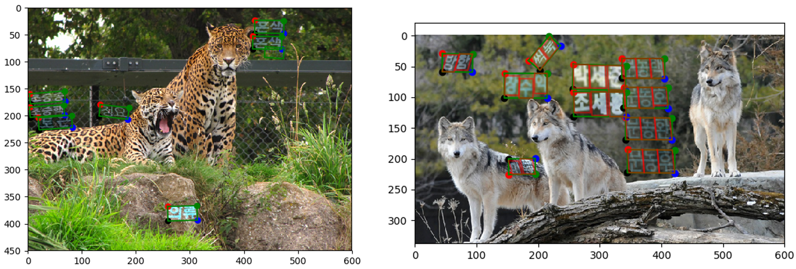

# SynthText_kr

This is KOREAN version code of original SynthText scene-text image generator.
(You can find the English, original version in here: https://github.com/ankush-me/SynthText)

Code for generating synthetic text images as described in "Synthetic Data for Text Localisation in Natural Images", Ankush Gupta, Andrea Vedaldi, Andrew Zisserman, CVPR 2016.

Korean Synthetic Scene-Text Image Samples 


The main dependencies are:
```
pygame, opencv (cv2), PIL (Image), numpy, matplotlib, h5py, scipy
```
### Pre-processed Background Images

The 8,000 background images used in the paper, along with their segmentation and depth masks, have been uploaded here:
`http://www.robots.ox.ac.uk/~vgg/data/scenetext/preproc/<filename>`, where, `<filename>` can be:

- `imnames.cp` [180K]: names of filtered files, i.e., those files which do not contain text
- `bg_img.tar.gz` [8.9G]: compressed image files (more than 8000, so only use the filtered ones in imnames.cp)
- `depth.h5` [15G]: depth maps
- `seg.h5` [6.9G]: segmentation maps

Note: I do not own the copyright to these images.

### Generating scene-text images with background

The background image files are saved in `bg_img` directory. The following files are used to generate the images.
  - **data/fonts**: several sample fonts (add more fonts to this folder and then update `fonts/fontlist.txt` with their paths). You must put Korean fonts, otherwise you cannot print out the letters in the picture properly.
  - **data/newsgroup**: Text-source (from the News Group dataset). This can be subsituted with any text file. Look inside `text_utils.py` to see how the text inside this file is used by the renderer.
  - **data/models/colors_new.cp**: Color-model (foreground/background text color model), learnt from the IIIT-5K word dataset.
  - **data/models**: Other cPickle files (**char\_freq.cp**: frequency of each character in the text dataset; **font\_px2pt.cp**: conversion from pt to px for various fonts: If you add a new font, make sure that the corresponding model is present in this file, if not you can add it by adapting `invert_font_size.py`).

### Sample Korean Fonts

There are some sample Korean fonts you can use like the following. If you want to use these fonts, you should update the `fonts/fontlist.txt` with their paths.

`https://koreaoffice-my.sharepoint.com/:f:/g/personal/ygseo_korea_edu/EvnQDCsjGMFGp8RIpoECvZUBtZ1FV1Wf7kUkRvz9kZqecg?e=QuQ21Z`

Note: I do not own the copyright to these fonts.

```
python make_h5.py
```

This will generate random scene-text image files with background images and store them in an h5 file in `dset_kr.h5`. When it generates the image, it also creates the following files.
 - `word_text.txt`: words that are generated from scene-text.
 - `char_text.txt`: characters that are splited from words.

```
python visualize_results.py
```

This will generate the followings from stored images in `dset_kr.h5`. There are 3 types of dataset that you can generate.
- `~/images`: Scene-text image files
- `~/words`: Word image files from `~/images`               
- `~/characters`: Character image files from `~/images`

Also, you can get the coordinate files of characters and words each
- `ch_coords.txt`: Characters' each coordinate in scene-text image files
- `wd_coords.txt`: Words' each coordinate in scene-text image files

### Adding New Images
Segmentation and depth-maps are required to use new images as background. Sample scripts for obtaining these are available [here](https://github.com/ankush-me/SynthText/tree/master/prep_scripts).

* `predict_depth.m` MATLAB script to regress a depth mask for a given RGB image; uses the network of [Liu etal.](https://bitbucket.org/fayao/dcnf-fcsp/) However, more recent works (e.g., [this](https://github.com/iro-cp/FCRN-DepthPrediction)) might give better results.
* `run_ucm.m` and `floodFill.py` for getting segmentation masks using [gPb-UCM](https://github.com/jponttuset/mcg).

For an explanation of the fields in `dset.h5` (e.g.: `seg`,`area`,`label`), please check this [comment](https://github.com/ankush-me/SynthText/issues/5#issuecomment-274490044).

### Further Information
Please refer to the paper for more information, or contact the author (email address in the paper).
If you find errors for koreans, don't hesitate to give me an email: ygseo@korea.ac.kr
